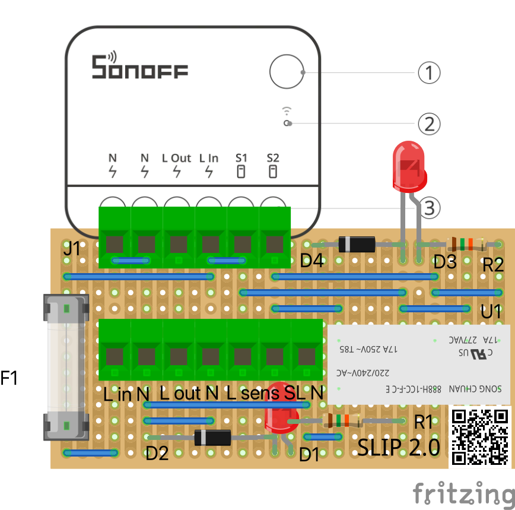
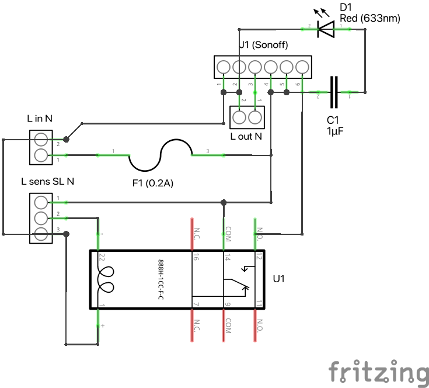
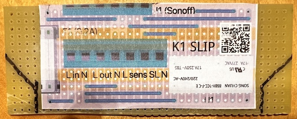
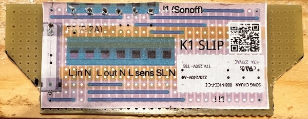
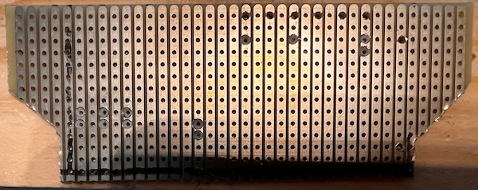
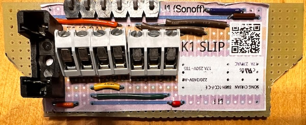
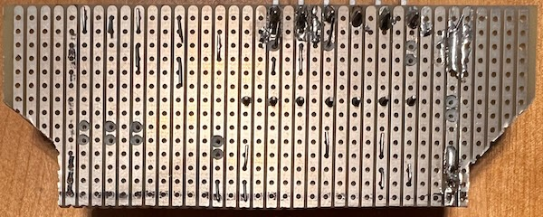

# K1 Smart Lighting Interface to PIR (SLIP)

For the [Smart Lighting](https://github.com/marmaladelane/smart-lighting) project, we need a way to connect PIR sensors to the smart lighting controller.

The most common and easily available outdoor (weatherproof) PIR sensors are the mains-powered ones, usually used to control lights directly. In theory we should be able to monitor the switched live (SL) output from one of these devices, using a device with a mains voltage level input, such as a [Sonoff ZBMINIR2](https://help.sonoff.tech/docs/zbminir2).

Unfortunately, this [does not work](https://electronics.stackexchange.com/questions/769672/sonoff-zbminir2-switched-live-input-from-pir-sensor), probably because a snubber network inside the PIR sensor, across the relay output contacts, leaks enough current to trigger the Sonoff's AC input (S2) even when the output is off. I couldn't find an easy way to fix that except to place a relay between the PIR sensor's output and the Sonoff's input.

To connect the relay and make the wiring easier and safer, I designed this circuit board to hold the relay and switch and a set of screw terminals for each connection (live in, live out and PIR sensor):

You can open the [source file](board-v2.fzz) in [Fritzing](https://fritzing.org) (open source, small charge for binary download) or print the [printable PDF](board-v2-breadboard.pdf). There is also a PCB in the Fritzing file, but it's untested.

## Principle of operation

This is the circuit schematic:

The circuit is protected by a small glass fuse (e.g. 0.2 A) as the load is expected to be extremely low: just some small digital electronics, a small relay and a low-power Zigbee radio. The mains output (L out N) connector would normally be unused. If you use it, you may need a larger fuse, and you might want to double-check the resistance of the tracks, wires and solder joints.

* Live mains comes into the "L in N" connector.
* The live side goes through the small glass fuse F1 into the Sonoff (L In).
* The Sonoff internally connects L In to S1 (live out to the "switch"), and a jumper wire does too.
* Live (L In) connects via a capacitive dropper (C1) to the power LED (D1).
* S1 is connected to one side of the relay's switched contact.
* S2 is connected to the other side of the relay's switched contact.
* S1 is also connected to the power supply for the PIR sensor (L sens).
* The PIR sensor's switched live output (SL) is connected to one side of the coil of the relay (U1).
* The other side of the coil is connected to neutral (N).
* When the PIR sensor's output is high, the coil magnetises and closes the contact, sending the live signal to the Sonoff (S2).

The Sonoff should be configured to send a signal to the smart lighting controller (HomeAssistant) when its switch input (S2) is active.

## Safety warning

### ⚠️ WARNING: This circuit uses live mains voltage, which can kill!

Do not attempt to build this circuit unless you are sufficiently skilled and comfortable with soldering, and observe all sensible safety precautions, including but not limited to:

* Test the circuit thoroughly before connecting to the mains, as described below under Testing.
* Install appropriate fuses (the minimum possible values) on the board and its AC mains voltage supply.
* Always use a [residual current device](https://www.screwfix.com/p/masterplug-13a-unfused-plug-through-active-rcd-adaptor/63731) when connecting to mains, especially during development.
* Always double-check that power is disconnected before touching the board (e.g. visual check, use a voltage tester and check the power LED).
* Keep an electrical-safe (not red/water) fire extinguisher nearby during development.
* Never leave the board powered unattended indoors.
* Only permanently install the board outdoors, away from flammable materials.
* Permanently install the board in a sealed, waterproof box which cannot be opened accidentally.
* Protect the board from water by sealing all holes in the box with rubber grommets and cable glands.

Note that the Sonoff device and this home-made board are not CE approved, and if either of them causes a fire it is entirely your responsibility.

## Bill of materials

| Component   | Code  | Qty | Cost  | Link | Notes |
| ----------- | ----- | --- | ----- | ---- | ----- |
| Stripboard  |       | 1   | £4.80 | https://cpc.farnell.com/kemo-electronic/e005/stripboard-fr4-100x160mm/dp/PC01603 |
| Fuse holder | F1    | 1   | £0.67 | https://uk.rs-online.com/web/p/fuse-holders/8930574 |
| Glass fuse  | 0.2 A | 1   | £0.06 | https://www.amazon.co.uk/dp/B0CD1Z6TDH | 
| Capacitor   | C1    | 1   | £0.40 | https://uk.rs-online.com/web/p/film-capacitors/2011934 |
| LED         | D1    | 1   | £0.15 | https://uk.rs-online.com/web/p/leds/2285916 |
| Sonoff connector | J1 | 1 | £2.54 | https://uk.rs-online.com/web/p/pcb-headers/1800623 | 0.2" pin spacing to mate with Sonoff |
| PCB Power Relay | U1 | 1  | £5.53 | https://uk.rs-online.com/web/p/power-relays/6803820P | 230V AC Coil |
| PCB terminal, 2 way | L in/out| 2 | £1.08 | https://cpc.farnell.com/camdenboss/ctb3000-2/pcb-terminal-45deg-low-prof-5mm/dp/CN19467 | 45 Degree Low Profile, 5mm spacing |
| PCB terminal, 3 way | L sens | 1 | £0.87 | https://cpc.farnell.com/camdenboss/ctb3000-3/pcb-terminal-45deg-low-prof-5mm/dp/CN19468 | 45 Degree Low Profile, 5mm spacing |
| PIR sensor (typical) |       | 1 | £15.98 | https://www.screwfix.com/p/zink-dion-indoor-outdoor-white-pir-twin-sensor-180-/718fh | With switched live output |
| Jumper wires |      | 1   | £6.39 | https://www.amazon.co.uk/Breadboard-Jumper-Wires-DIY-Accessories/dp/B0D5M9DN2K/ | Optional, but will save you a lot of time |

In addition, you will need a case large enough for the circuit board and sonoff (about 72x72 mm internal space):

* Either plug into a 13A outdoor wall socket, in which case an [outdoor junction box](https://www.amazon.co.uk/dp/B0156QPJNU) is fine ([this one](https://www.toolstation.com/spelsberg-ip65-junction-box/p61729) is slightly smaller).
* Or wired into the outdoor lighting circuit, in which case a [fused spur](https://www.toolstation.com/bg-ip66-spur/p25211) is required to allow easy and safe isolation, and the board can be mounted inside the same case.

And you might want to use rigid 20mm [conduit](https://www.screwfix.com/p/deta-tte-round-upvc-black-conduit-20mm-x-3m/580vt), [elbows](https://www.screwfix.com/p/deta-tte-black-inspection-elbow-20mm/187vt) and [adaptors](https://www.screwfix.com/p/deta-tte-female-conduit-adaptors-20mm-black-2-pack/907vt) to keep the cable protected, safe and tidy.

## Build process

Mark the stripboard to size of outline of board, plus any edges, cutouts and holes needed to hold it in place inside its case (see above). Ensure that the strips run in the correct direction before cutting!

Print out a copy of the breadboard layout, and glue it to the top side of the board (you can use pritt stick for this). Ensure tha the holes on the print line up with the holes pre-drilled in the board before the glue sets:

Cut along the lines with a junior hacksaw. Cut from the edges towards the middle of the board, otherwise it may snap. Sand down the sharp cut edges for safety.

Poke a pin through the paper (into the pre-drilled hole below) where the where the tracks should be cut, so you can see through the holes from the other side, then gently drill with a 3mm bit from the other side, **not** all the way through the board, just enough to break the copper track completely (both sides):

Some of the pre-drilled holes need to be enlarged to take the larger pins of some components:

* The Sonoff connector (J1).
* The PCB terminals (in, out, sens).
* The fuse holder (F1).

Use the actual terminal blocks to determine where the pins are that should be drilled through, not the green markings on the breadboard image (these are a different type of terminal blocks).

Poke a pin through these holes, then drill through with a 1.5mm bit.

Poke a pin through all remaining component holes (C1, D1, U1) and wire ends. Cut wires to length (or use pre-formed breadboard jumper wires) and mount on the board. Ignore the other components already mounted in this photo, it's better to mount all the wires first:

On the underside of the board, bend the bare wire ends over to hold them in place, and solder them:

Mount and solder the remaining components onto the board (see photo above). Clip the PCB terminals together so they don't sit awkwardly like mine did.

## Testing

Test all the following **before** applying mains power.

With no wires connected to the PCB terminals, no glass fuse installed, no Sonoff installed, you should have:

* No continuity across track breaks.
* No shorts between adjacent tracks (test both sides of each track break separately).
* No continuity across the fuse holder (F1).
* High resistance (about 35k ohms) across the coil of the relay.
* No continuity between the centre and NO contacts of the relay U1.
* Continuity between the north side of the fuse holder and:
  * *L In* and *S1* on the Sonoff,
  * the *L sens* terminal,
  * the right-hand side of capacitor C1,
  * the centre contact of relay U1.
* Continuity between the *SL* terminal and the upper side of the coil of relay U1.
* Continuity between the *N in* terminal and:
  * The lower side of the coil of relay U1,
  * The other two N terminals,
  * The N pin of the Sonoff (J1).
* No continuity between any of the Live terminals and any of the Neutral terminals.
